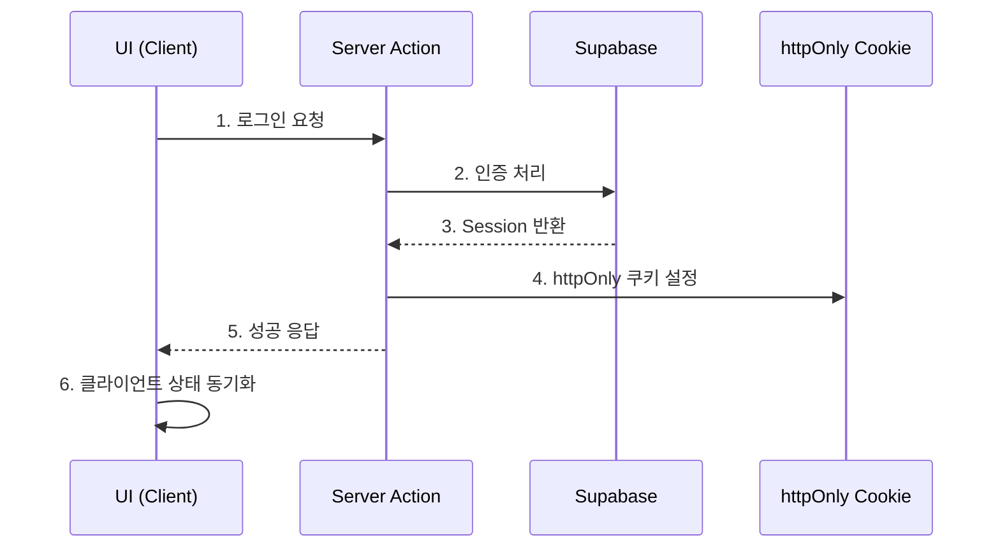

# Semicolon Community Architecture Guide v3.0

> 이 문서는 Semicolon Community 생태계의 아키텍처 결정사항과 구현 가이드라인을 제공합니다.
> **Last Updated**: 2024-09-23
> **Version**: 3.0.0

## 📚 Table of Contents

1. [핵심 아키텍처 결정사항](#핵심-아키텍처-결정사항)
2. [기술 스택](#기술-스택)
3. [프로젝트 구조](#프로젝트-구조)
4. [인증 시스템](#인증-시스템)
5. [상태 관리](#상태-관리)
6. [데이터 페칭](#데이터-페칭)
7. [실시간 기능](#실시간-기능)
8. [코딩 컨벤션](#코딩-컨벤션)
9. [마이그레이션 가이드](#마이그레이션-가이드)
10. [성능 최적화](#성능-최적화)

---

## 핵심 아키텍처 결정사항

### 🎯 설계 원칙

1. **간단하고 명확한 구조**: 복잡한 추상화보다 직관적인 코드
2. **점진적 개선**: 초기에는 좋은 구조에 집중, 성능 최적화는 단계적으로
3. **재사용성**: 커뮤니티 간 공통 기능 모듈화
4. **보안 우선**: httpOnly 쿠키, Server Actions 활용

### 📋 주요 결정사항

| 영역           | 선택                          | 이유                                     |
| -------------- | ----------------------------- | ---------------------------------------- |
| **프레임워크** | Next.js 15 (App Router)       | SSR/SSG 지원, 최신 React 기능            |
| **상태관리**   | Zustand                       | 경량, 간단한 API, TypeScript 친화적      |
| **서버 상태**  | TanStack Query v5             | 강력한 캐싱, 동기화, 옵티미스틱 업데이트 |
| **인증**       | Supabase Auth + httpOnly 쿠키 | XSS 방지, 보안 강화                      |
| **실시간**     | Supabase Realtime             | 통합 용이, WebSocket 관리 자동화         |
| **스타일링**   | Tailwind CSS + Shadcn/ui      | 일관된 디자인 시스템                     |
| **검증**       | Zod                           | 런타임 타입 안전성                       |
| **날짜**       | date-fns                      | moment.js 대비 경량                      |

---

## 기술 스택

### 필수 패키지

```json
{
  "dependencies": {
    // Core Framework
    "next": "^15.1.4",
    "react": "^19.0.0",
    "react-dom": "^19.0.0",

    // State Management
    "zustand": "^4.5.0",
    "immer": "^10.0.0",

    // Data Fetching
    "@tanstack/react-query": "^5.0.0",

    // Supabase
    "@supabase/supabase-js": "^2.45.0",
    "@supabase/ssr": "^0.3.0",

    // Utilities
    "zod": "^3.22.0",
    "date-fns": "^3.0.0",
    "clsx": "^2.1.0"
  }
}
```

### ⚠️ 사용하지 않는 패턴

- ❌ `serviceByServerSide` 패턴 - Server Actions 사용
- ❌ Redux Toolkit - Zustand 사용
- ❌ Lodash - Native ES6 + date-fns 사용
- ❌ Moment.js - date-fns 사용

---

## 프로젝트 구조

### 📁 디렉토리 구조

```
src/
├── app/                           # Next.js App Router
│   ├── (auth)/                   # 인증 관련 라우트 그룹
│   │   ├── login/
│   │   └── signup/
│   ├── (community)/              # 커뮤니티 라우트 그룹
│   │   ├── board/
│   │   └── posts/
│   ├── api/                      # API Routes (최소 사용)
│   └── layout.tsx                # Root Layout
│
├── features/                      # 기능별 모듈 (Domain Driven)
│   ├── auth/
│   │   ├── components/           # 인증 관련 컴포넌트
│   │   ├── hooks/               # useAuth, useSession
│   │   ├── stores/              # authStore.ts (Zustand)
│   │   ├── services/            # auth.service.ts
│   │   ├── actions/             # server-actions.ts
│   │   └── types/               # auth.types.ts
│   │
│   ├── board/
│   │   ├── components/
│   │   ├── hooks/               # useBoard, usePosts
│   │   ├── queries/             # 📌 TanStack Query 정의
│   │   ├── services/
│   │   └── types/
│   │
│   └── realtime/
│       ├── chat/
│       └── notifications/
│
├── shared/                        # 공유 모듈
│   ├── components/               # 공통 UI 컴포넌트
│   │   ├── atoms/               # Shadcn/ui 기반
│   │   ├── molecules/
│   │   └── organisms/
│   ├── hooks/                   # 공통 커스텀 훅
│   ├── lib/                     # 유틸리티
│   │   ├── supabase/           # Supabase 클라이언트
│   │   ├── query-client/       # TanStack Query 설정
│   │   └── utils/              # 헬퍼 함수
│   └── types/                   # 공통 타입
│
└── core/                         # @team-semicolon/community-core
    ├── services/                # 핵심 비즈니스 로직
    └── providers/               # 전역 Provider
```

### 📝 파일 명명 규칙

```typescript
// 컴포넌트: PascalCase
BoardList.tsx;
UserProfile.tsx;

// 훅: camelCase, use 접두사
useAuth.ts;
useBoardQuery.ts;

// 서비스: camelCase, .service 접미사
auth.service.ts;
board.service.ts;

// 스토어: camelCase, .store 접미사
auth.store.ts;
ui.store.ts;

// 타입: camelCase, .types 접미사
auth.types.ts;
board.types.ts;

// Server Actions: camelCase, .actions 접미사
auth.actions.ts;
board.actions.ts;
```

---

## 인증 시스템

### 🔐 인증 플로우



### 구현 예시

```typescript
// src/features/auth/actions/auth.actions.ts
"use server";

import { cookies } from "next/headers";
import { createServerClient } from "@/shared/lib/supabase/server";

export async function signIn(email: string, password: string) {
  const supabase = createServerClient();

  const { data, error } = await supabase.auth.signInWithPassword({
    email,
    password,
  });

  if (data.session) {
    // httpOnly 쿠키 설정
    cookies().set("sb-access-token", data.session.access_token, {
      httpOnly: true,
      secure: process.env.NODE_ENV === "production",
      sameSite: "lax",
      maxAge: 60 * 60 * 24 * 7, // 7일
      path: "/",
    });

    cookies().set("sb-refresh-token", data.session.refresh_token, {
      httpOnly: true,
      secure: process.env.NODE_ENV === "production",
      sameSite: "lax",
      maxAge: 60 * 60 * 24 * 30, // 30일
      path: "/",
    });
  }

  return { success: !error, error: error?.message };
}
```

```typescript
// src/features/auth/components/LoginForm.tsx
'use client';

import { signIn } from '../actions/auth.actions';
import { useAuthStore } from '../stores/auth.store';

export function LoginForm() {
  const setUser = useAuthStore(state => state.setUser);

  async function handleSubmit(formData: FormData) {
    const email = formData.get('email') as string;
    const password = formData.get('password') as string;

    const result = await signIn(email, password);

    if (result.success) {
      // 클라이언트 상태 동기화
      setUser({ email });
      router.push('/dashboard');
    }
  }

  return (
    <form action={handleSubmit}>
      {/* 폼 필드 */}
    </form>
  );
}
```

---

## 상태 관리

### 🗂️ Zustand Store 패턴

```typescript
// src/features/auth/stores/auth.store.ts
import { create } from "zustand";
import { immer } from "zustand/middleware/immer";

interface AuthState {
  user: User | null;
  isLoading: boolean;

  // Actions
  setUser: (user: User) => void;
  clearUser: () => void;
  setLoading: (loading: boolean) => void;
}

export const useAuthStore = create<AuthState>()(
  immer((set) => ({
    user: null,
    isLoading: false,

    setUser: (user) =>
      set((state) => {
        state.user = user;
      }),

    clearUser: () =>
      set((state) => {
        state.user = null;
      }),

    setLoading: (loading) =>
      set((state) => {
        state.isLoading = loading;
      }),
  })),
);
```

### 사용 원칙

- **클라이언트 상태만 관리**: UI 상태, 임시 폼 데이터
- **서버 상태는 TanStack Query로**: API 데이터는 Query로 관리
- **전역 상태 최소화**: 꼭 필요한 것만 전역으로

---

## 데이터 페칭

### 📡 TanStack Query 패턴

```typescript
// src/features/board/queries/board.queries.ts
import { useMutation, useQuery, useQueryClient } from "@tanstack/react-query";
import { boardService } from "../services/board.service";

// Query Keys
export const boardKeys = {
  all: ["boards"] as const,
  lists: () => [...boardKeys.all, "list"] as const,
  list: (filters: string) => [...boardKeys.lists(), { filters }] as const,
  details: () => [...boardKeys.all, "detail"] as const,
  detail: (id: number) => [...boardKeys.details(), id] as const,
};

// Query Hooks
export function useBoardList(page: number = 1) {
  return useQuery({
    queryKey: boardKeys.list(`page-${page}`),
    queryFn: () => boardService.getList(page),
    staleTime: 1000 * 60 * 5, // 5분
  });
}

export function useBoardDetail(id: number) {
  return useQuery({
    queryKey: boardKeys.detail(id),
    queryFn: () => boardService.getById(id),
    enabled: !!id,
  });
}

// Mutation Hooks
export function useCreateBoard() {
  const queryClient = useQueryClient();

  return useMutation({
    mutationFn: boardService.create,
    onSuccess: () => {
      queryClient.invalidateQueries({
        queryKey: boardKeys.lists(),
      });
    },
  });
}
```

### 사용 예시

```typescript
// src/features/board/components/BoardList.tsx
'use client';

import { useBoardList } from '../queries/board.queries';

export function BoardList() {
  const { data, isLoading, error } = useBoardList(1);

  if (isLoading) return <Skeleton />;
  if (error) return <ErrorMessage />;

  return (
    <div>
      {data?.items.map(board => (
        <BoardItem key={board.id} {...board} />
      ))}
    </div>
  );
}
```

---

## 실시간 기능

### 💬 Supabase Realtime 패턴

```typescript
// src/features/realtime/hooks/useRealtimeChannel.ts
import { useEffect } from "react";
import { createBrowserClient } from "@/shared/lib/supabase/client";

export function useRealtimeChannel(channel: string, onMessage: (payload: any) => void) {
  const supabase = createBrowserClient();

  useEffect(() => {
    const subscription = supabase
      .channel(channel)
      .on(
        "postgres_changes",
        {
          event: "*",
          schema: "public",
          table: "messages",
        },
        onMessage,
      )
      .subscribe();

    return () => {
      subscription.unsubscribe();
    };
  }, [channel, onMessage]);
}
```

### 알림 시스템 구조

```typescript
// src/features/realtime/notifications/hooks/useNotifications.ts
export function useNotifications(userId: string) {
  const queryClient = useQueryClient();

  useRealtimeChannel(`notifications:${userId}`, (payload) => {
    // 새 알림 처리
    if (payload.eventType === "INSERT") {
      // 알림 표시
      showNotification(payload.new);

      // 쿼리 무효화
      queryClient.invalidateQueries({
        queryKey: ["notifications", userId],
      });
    }
  });
}
```

---

## 코딩 컨벤션

### ✅ 필수 규칙

```typescript
// 1. Server Actions는 항상 'use server' 지시어
'use server';

// 2. 클라이언트 컴포넌트는 'use client' 지시어
'use client';

// 3. 타입 우선 개발
interface Props {
  title: string;
  description?: string;
}

// 4. 에러 핸들링
try {
  const result = await someAction();
  return { success: true, data: result };
} catch (error) {
  return { success: false, error: error.message };
}

// 5. Loading/Error 상태 처리
if (isLoading) return <Skeleton />;
if (error) return <ErrorBoundary error={error} />;
```

### 📏 코드 스타일

```typescript
// Import 순서
import { useState } from 'react';              // 1. React
import { useQuery } from '@tanstack/react-query'; // 2. 외부 라이브러리
import { Button } from '@/shared/components';    // 3. 내부 절대 경로
import { useAuth } from '../hooks';              // 4. 상대 경로
import type { User } from './types';             // 5. 타입 imports

// 컴포넌트 구조
export function ComponentName({ prop1, prop2 }: Props) {
  // 1. Hooks
  const [state, setState] = useState();
  const { data } = useQuery();

  // 2. Handlers
  const handleClick = () => {};

  // 3. Effects
  useEffect(() => {}, []);

  // 4. Render
  return <div>...</div>;
}
```

---

## 마이그레이션 가이드

### 📅 단계별 실행 계획

#### Phase 1: 기초 설정 (Week 1)

```bash
# 1. 필수 패키지 설치
npm install zustand immer @tanstack/react-query @supabase/ssr zod date-fns clsx

# 2. 기본 디렉토리 구조 생성
mkdir -p src/{features,shared,core}
mkdir -p src/features/{auth,board,realtime}/{components,hooks,stores,services,types}
mkdir -p src/shared/{components,hooks,lib,types}

# 3. 설정 파일 생성
touch src/shared/lib/query-client.ts
touch src/shared/lib/supabase/client.ts
touch src/shared/lib/supabase/server.ts
```

#### Phase 2: 공통 기능 추출 (Week 2)

- [ ] BaseService 클래스 구현
- [ ] Board 서비스 마이그레이션
- [ ] Comment 서비스 마이그레이션
- [ ] User 서비스 마이그레이션

#### Phase 3: 실시간 기능 (Week 3)

- [ ] Realtime 채널 구현
- [ ] 채팅 시스템 구현
- [ ] 알림 시스템 구현

#### Phase 4: 최적화 (Week 4+)

- [ ] 번들 크기 분석
- [ ] Dynamic imports 적용
- [ ] 이미지 최적화

---

## 성능 최적화

### 🚀 최적화 전략

#### 1. 코드 스플리팅

```typescript
// Dynamic import
const BoardEditor = dynamic(
  () => import('@/features/board/components/BoardEditor'),
  {
    loading: () => <EditorSkeleton />,
    ssr: false
  }
);
```

#### 2. 이미지 최적화

```typescript
import Image from 'next/image';

<Image
  src="/image.jpg"
  width={800}
  height={600}
  alt="Description"
  loading="lazy"
  placeholder="blur"
/>
```

#### 3. 쿼리 최적화

```typescript
// Prefetch on hover
const queryClient = useQueryClient();

<Link
  href={`/board/${id}`}
  onMouseEnter={() => {
    queryClient.prefetchQuery({
      queryKey: boardKeys.detail(id),
      queryFn: () => boardService.getById(id)
    });
  }}
>
```

### 📊 성능 목표

| 지표          | 목표    | 측정 도구       |
| ------------- | ------- | --------------- |
| **초기 로딩** | < 3초   | Lighthouse      |
| **FCP**       | < 1.8초 | Web Vitals      |
| **TTI**       | < 3.5초 | Web Vitals      |
| **번들 크기** | < 500KB | Bundle Analyzer |
| **동시 접속** | 2,000명 | Load Testing    |

---

## 부록

### 🔗 참고 자료

- [Next.js 15 Docs](https://nextjs.org/docs)
- [Zustand Documentation](https://zustand-demo.pmnd.rs/)
- [TanStack Query v5](https://tanstack.com/query/latest)
- [Supabase Docs](https://supabase.com/docs)

### 📝 체크리스트

개발 시작 전 확인사항:

- [ ] Node.js 20+ 설치
- [ ] 환경변수 설정 (.env.local)
- [ ] Supabase 프로젝트 생성
- [ ] TypeScript 설정 확인
- [ ] ESLint/Prettier 설정

### 🤝 기여 가이드

1. Feature 브랜치 생성: `feature/기능명`
2. 커밋 메시지: `feat: 기능 추가`, `fix: 버그 수정`
3. PR 작성 시 템플릿 사용
4. 코드 리뷰 후 머지

---

**Last Modified**: 2024-09-23
**Maintainer**: Semicolon Community Team
**Version**: 3.0.0
